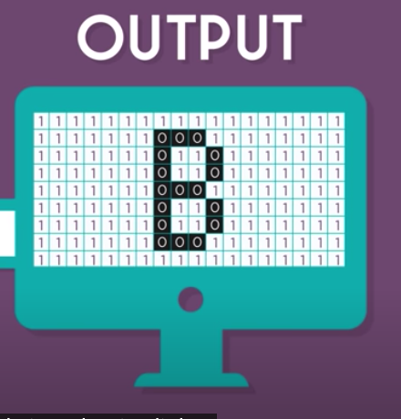

# How Computer Works

Software is not physical but hardware are. What's the link between them?

## What does a COMPUTER do?

Easy, a Computer PROCESS some INPUTS to produce some OUTPUTS.

## INPUTS and OUTPUS

What are the INPUTS? - electrical pulses

What are the OUTPUTS? - electrical pulses

> Wait, so Skyrim is actually just a bunch of electrical pulses? I have two questions:
>
> 1. What does electrical pulses have to do with me seeing my character on the screen?
> 2. How is it that when I press the Up button on my keyboard, the character on the screen is shown to be moving up?

When you press the Up key on the keyboard, the keyboard sends electrical pulses to the COMPUTER. The COMPUTER `processes` those pulses and send out electrical pulses to the monitor.

What you see on the screen is just how the monitor (the hardware) was manufactured to react to the pulses (turning on red light here, blue light there...).

 ~ [Khan Academy](https://www.khanacademy.org/computing/computers-and-internet/xcae6f4a7ff015e7d:computers/xcae6f4a7ff015e7d:computer-components/v/khan-academy-and-codeorg-cpu-memory-input-output)

## Electrical Pulses to Computer Game

> Ok, but in the picture above, I don't see any electrical pulses but a bunch of `1`s and `0`s. I'm not into Physics but eletrical pulses should have something to do with Voltage and Current and not `1`s and `0`s.

Right. Forget about `1`s and `0`s, electrical pulses are measured in Voltage (I'm not sure if electrical pulse is even the right word to use but you get the idea). It is the COMPUTER (transistor) that interprets voltage from 0V - 0.8V to be "low" (or 0) and 2.4V - 5.0V to be "high" (or 1) [ref](Computer Architecture and Organization - chapter 3).

> What does the COMPUTER actually do when it `processes` the electrical pulses (or signals)?

That simply means the COMPUTER figuring out the correct sequence of electrical pulses to produce given a specific sequence of electrical pulses.

> How does that happen?

So the point of processing the electrical pulses is to be able to produce some specific electrical pulses (sequence of high and low pulses) given some specific electrical pulses. `Logic gates` are hardware which are made of `transistors` and allow this phenomenom. For example, you can send a sequence of high-low-high electrical pulses to a kind of logic gate called NOT and be sure to receive low-high-low electrical pulses.

> Well, then how programmer write software to create games?

Computer games (or any software) are `stored` on a hard disk. We won't discuss how a hard disk stores data. When the game is run on the COMPUTER, data flows from the hard disk into the COMPUTER. It's reasonable to accept that the so-called data flowing from the hard disk into the COMPUTER is just electrical pulses. The logic gates will combine the electrical pulses sending in from the keyboard with those provided by the software to produce a specific sequence of electrical pulses.
