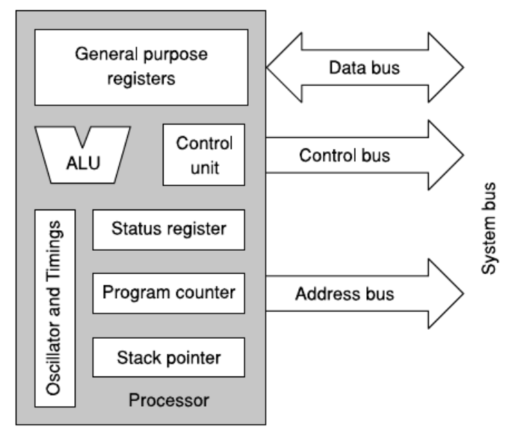
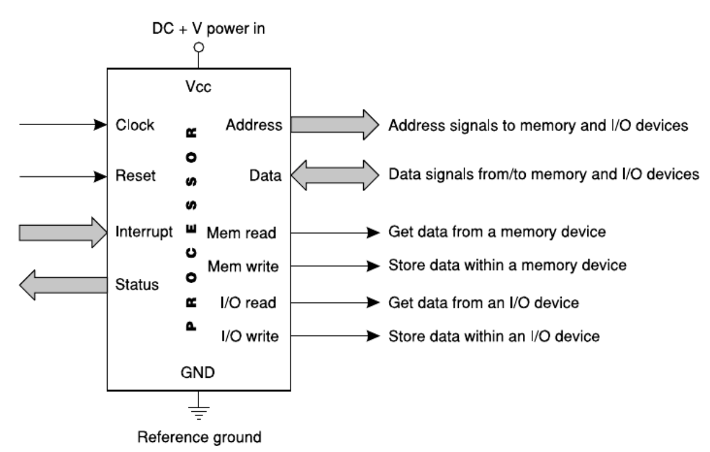
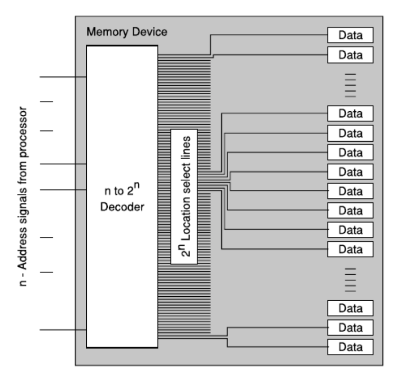
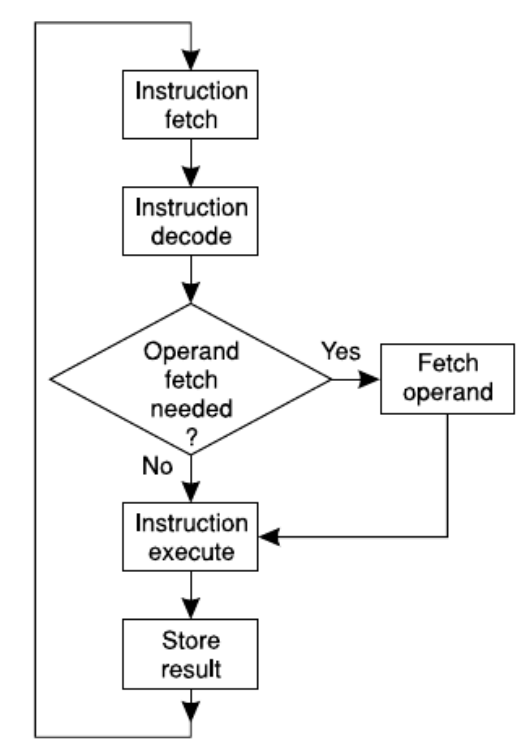
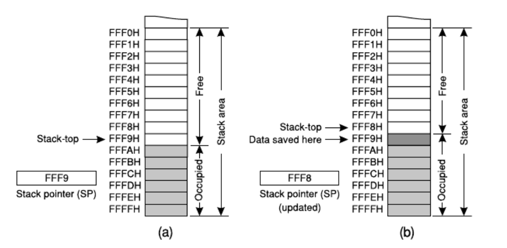
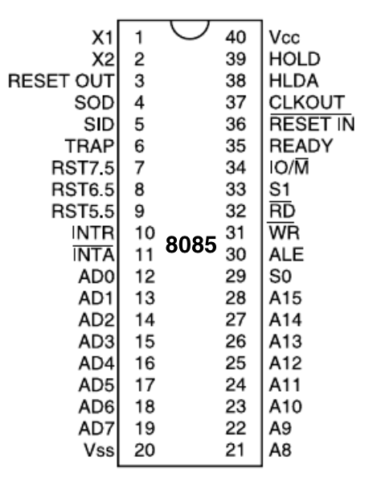
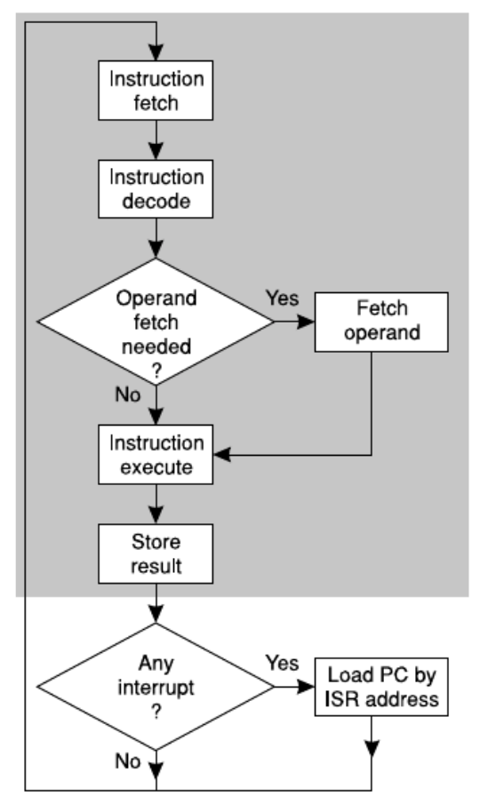

Following summary is extracted from Chapter 5 of [Computer Architecture and Organization](https://www.amazon.com/Computer-Architecture-Organization-Core2duo-Beyond/dp/813176155X), briefly disccusing the Processor.

**NOTE**: Most of this summary are full quotes from the book.

# Components of a Processor

Bus shown by double lined arrow have multiple signals. Ex: Address signals maybe READ/WRITE or more.

1. ALU: performs arithmetic and boolean operation
2. Registers: stores special and general data
3. Data buses: transfers Signal, Data and Address.
4. Control Unit: Renerates control signals & manages general working of the processor (remember to READ/WRITE from/to memory, CPU must send the address to the Memory along with a Control Signal)
5. Oscillator and Timing module: comprises the internal clock (remember how the internal clock increments the PC and maintains the synchronization of the 3 data buses above)

# Address Bus and Addressing

> The width of address bus or number of address lines available from any processor indicates its maximum memory size handling capability. The number of memory locations (bytes or words as the case might be) addressable by n address lines is 2^n . Therefore, if the processor offers 16 address lines then it can address 2^16 or 64K locations (1K = 2^10 = 1,024). If it is offering 20 address lines then it can address 2^20 or 1M locations and so on.

# Processor Operation

A processor goes into this loop as soon as it's powered up.

The job of the processor is to execute programs, which are composed of multiple instructions in the form of machine code. Programs developed with high level language instructions are first changed to this machine code, understandable by the processor.

These instructions must be present in binary form within the memory.

_NOTE about Instruction Fetch_: instructions are stored in memory. The Processor must get the correct address of the memory to extract the instruction byte.

Is this familiar? It should be. A typical program is compiled into a binary file and stored on harddrive. This binary file contains instructions in machine code among other things. When run, it is loaded onto memory. The processor then fetches these instructions from memory, decodes and executes them.

# Register Set

Several registers (which are flip flops) exist inside the processor to store temporary information or operands. The number of registers vary from processor to processor.

However, there are registers universal to most processors.

| Register                  | Purpose                                                                                                                                                                                                                                                                                                                                                                                                        |
| ------------------------- | -------------------------------------------------------------------------------------------------------------------------------------------------------------------------------------------------------------------------------------------------------------------------------------------------------------------------------------------------------------------------------------------------------------- |
| Status                    | aids in arithmetic/logical operations such as providing the carry bit                                                                                                                                                                                                                                                                                                                                          |
| Program Counter           | holds the address of the memory location for next instruction byte/word to be fetched by the processor; is incremented by one to point to the next byte after fetching an instruction byte with the exception of program branching when it is reloaded by a new value; is always initialized during system reset so the first executable instruction byte is fetched from a predefined location of the memory. |
| General Purpose Registers | stores temporary data                                                                                                                                                                                                                                                                                                                                                                                          |

# Stack

Whenever any data are placed on the stack-top or taken out from it, Stack Pointer is also automatically changed by the processor to make sure the stack pointer always points to the top of the stack.

> Stacks are widely used for subroutine calls. In these cases, the return address from the subroutine is placed on the stack-top before branching to the subroutine. As subroutines are always terminated by a RETURN instruction, once the execution of the subroutine is complete, this RETURN instruction forces the processor to load the program counter from the stack-top, producing an effect of returning to the original part of the program that was left to branch to the subroutine

# Interupts

Processors provide some input pins thorugh which external devices can send signals to the processor to draw its immediate attention for receiving a byte of data or to terminate a process or features related to the external sending the signal.

These signals must be recognized as urgent requests and the processor must leave everything it's performing and service this device immediately.

These inputs of the processors are designated as interrupt inputs and the procedure through which the immediate need is fullfilled is known as interrupt handling.

The number of available interrupt inputs varies from one processor to another.

After servicing an interrupt, the processor must resume its original work which was left half-way because of the interrupt. This is achieved through the system stack as described above.

The INTR pin above is an interrupt input pin.

**NOTE** So an `interrupt` is actually a hardware thing. It's an input pin of the processor.

## Interrupt Service Routine (ISR)

> To service any interrupt, the processor must execute a special routine developed to cater the need of the interrupting device. These service routines are known as interrupt service routines (ISR) and terminated by a RETURN (or similar) instruction.
> Before branching to the proper interrupt service routine, as it is customary for the processor to store the address of the next executable instruction on the stack-top, the execution of the RETURN instruction at the termination of ISR brings back the program control to its original point, which it had left at the time of receiving the interrupt.
> In other words, an interrupt may be visualized as an external hardware signal forcing the processor to execute a special c subroutine, i.e., the ISR of the interrupting external device.

If the branching address of the interrupt, the location of its ISR is predefined, then the interrupt is designated as a vectored interrupt. Otherwise, it would be taken as a non-vectored interrupt and the branching address is supplied by the interrupting device.

**NOTE** The opearting system typically keeps a table of interrupt signals and its their respective location of its ISR.

